# Documentation Technique – Système de Gestion des Événements d'Entreprise

## Page de Garde
- **Titre du Projet** : Système de Gestion des Événements d'Entreprise  
- **Auteur** : Mohammad Radwan  
- **Classe** : BTS SIO SLAM 1ère année  
- **Date** : 16 mai 2025

---

## Table des Matières
- [Documentation Technique – Système de Gestion des Événements d'Entreprise](#documentation-technique--système-de-gestion-des-événements-dentreprise)
  - [Page de Garde](#page-de-garde)
  - [Table des Matières](#table-des-matières)
  - [1. Introduction](#1-introduction)
  - [2. Gestion de Projet](#2-gestion-de-projet)
    - [Méthodologie Adoptée](#méthodologie-adoptée)
    - [Planning Prévisionnel et Réel](#planning-prévisionnel-et-réel)
    - [Répartition du Temps par Phase](#répartition-du-temps-par-phase)
    - [Difficultés de Gestion](#difficultés-de-gestion)
  - [3. Analyse des Besoins et Cas d’Utilisation](#3-analyse-des-besoins-et-cas-dutilisation)
    - [Objectifs](#objectifs)
    - [Utilisateurs Cibles](#utilisateurs-cibles)
    - [Cas d’Utilisation](#cas-dutilisation)
  - [4. Modèle Conceptuel de Données (MCD)](#4-modèle-conceptuel-de-données-mcd)
  - [5. Architecture du Projet](#5-architecture-du-projet)
    - [Structure des Fichiers](#structure-des-fichiers)
    - [Schéma MVC](#schéma-mvc)
  - [6. Technologies Utilisées](#6-technologies-utilisées)
    - [Backend](#backend)
    - [Frontend](#frontend)
    - [Infrastructure](#infrastructure)
  - [7. Choix Techniques et Patterns Utilisés](#7-choix-techniques-et-patterns-utilisés)
  - [8. Concepts Fondamentaux du Développement Web](#8-concepts-fondamentaux-du-développement-web)
  - [9. Guide d'Installation et de Déploiement](#9-guide-dinstallation-et-de-déploiement)
    - [Prérequis](#prérequis)
    - [Installation](#installation)
  - [10. Manuel d’Utilisation](#10-manuel-dutilisation)
    - [Connexion](#connexion)
    - [Tableau de Bord](#tableau-de-bord)
    - [Gestion des Événements](#gestion-des-événements)
    - [Réservations](#réservations)
  - [11. Fonctionnalités](#11-fonctionnalités)
    - [Exemple de Code](#exemple-de-code)
  - [12. Sécurité](#12-sécurité)
    - [Mesures Implémentées](#mesures-implémentées)
  - [13. Difficultés Rencontrées et Solutions Apportées](#13-difficultés-rencontrées-et-solutions-apportées)
  - [14. Perspectives d’Évolution](#14-perspectives-dévolution)
    - [Fonctionnalités](#fonctionnalités)
    - [Techniques](#techniques)
- [15. Liste des termes à définir](#15-liste-des-termes-à-définir)
  - [Architecture MVC (Modèle-Vue-Contrôleur)](#architecture-mvc-modèle-vue-contrôleur)
    - [1. Modèle (Model)](#1-modèle-model)
    - [2. Vue (View)](#2-vue-view)
    - [3. Contrôleur (Controller)](#3-contrôleur-controller)
  - [CRUD (Create, Read, Update, Delete)](#crud-create-read-update-delete)
    - [Routes typiques](#routes-typiques)
  - [Backend vs Frontend](#backend-vs-frontend)
    - [Backend](#backend-1)
    - [Frontend](#frontend-1)
  - [Programmation Orientée Objet en PHP](#programmation-orientée-objet-en-php)
    - [Concepts fondamentaux :](#concepts-fondamentaux-)
    - [Exemple :](#exemple-)
  - [Client-Serveur](#client-serveur)
    - [Exemple de flux :](#exemple-de-flux-)
  - [PHP 8.x](#php-8x)
    - [Nouveautés :](#nouveautés-)
    - [Exemple :](#exemple--1)
  - [MySQL](#mysql)
    - [SGBD relationnel :](#sgbd-relationnel-)
    - [Commandes SQL de base :](#commandes-sql-de-base-)
  - [HTML5 / CSS3](#html5--css3)
    - [HTML5 :](#html5-)
    - [CSS3 :](#css3-)
    - [Responsive Design :](#responsive-design-)
  - [JavaScript](#javascript)
    - [Utilités :](#utilités-)
    - [Manipulation DOM :](#manipulation-dom-)
    - [Validation formulaire :](#validation-formulaire-)
  - [Docker et conteneurisation](#docker-et-conteneurisation)
    - [Docker :](#docker-)
    - [Docker vs VM :](#docker-vs-vm-)
    - [Docker Compose :](#docker-compose-)
    - [Image vs Conteneur :](#image-vs-conteneur-)
  - [Sécurité Web (débutant)](#sécurité-web-débutant)
    - [1. Injection SQL :](#1-injection-sql-)
    - [2. Validation des données :](#2-validation-des-données-)
    - [3. Hachage des mots de passe :](#3-hachage-des-mots-de-passe-)
    - [4. Session PHP :](#4-session-php-)
  - [Base de données](#base-de-données)
    - [MCD (Modèle Conceptuel de Données) :](#mcd-modèle-conceptuel-de-données-)
    - [Entités :](#entités-)
    - [Clés :](#clés-)
    - [Relations :](#relations-)
  - [PDO (PHP Data Objects)](#pdo-php-data-objects)
    - [Avantages :](#avantages-)
    - [Exemple :](#exemple--2)
  - [Versioning et collaboration](#versioning-et-collaboration)
    - [Git :](#git-)
    - [GitHub :](#github-)
  - [Méthodologie de développement](#méthodologie-de-développement)
    - [Types de tests :](#types-de-tests-)
    - [Débogage :](#débogage-)
    - [Documentation :](#documentation-)
  - [16. Galerie d’Images](#16-galerie-dimages)

---

## 1. Introduction
Application web développée dans le cadre du BTS SIO SLAM pour la gestion des événements en entreprise.  
Fonctionnalités principales :
- Création et gestion d'événements
- Inscription des participants
- Visualisation des réservations
- Gestion des organisateurs

---

## 2. Gestion de Projet

### Méthodologie Adoptée
Approche agile avec tableau Kanban.

### Planning Prévisionnel et Réel

| Phase                  | Dates Prévisionnelles | Durée Estimée | Dates Réelles | Durée Effective | Écart |
|------------------------|------------------------|----------------|----------------|------------------|--------|
| Analyse et Conception | 18-25/04              | 7j            | 18-26/04       | 8j               | +1j   |
| Mise en Place Docker   | 26-27/04              | 2j            | 27-28/04       | 1.5j             | -0.5j |
| Développement Backend  | 28/04-01/05           | 4j            | 29/04-03/05    | 5j               | +1j   |
| Développement Frontend | 02-03/05              | 2j            | 04-05/05       | 2j               | 0j    |
| Tests et Corrections   | 03-04/05              | 1j            | 05-06/05       | 1.5j             | +0.5j |

### Répartition du Temps par Phase
- Analyse et Conception : 25%
- Développement Backend : 40%
- Développement Frontend : 20%
- Tests et Corrections : 10%
- Documentation : 5%

### Difficultés de Gestion
- Sous-estimation du temps pour l’authentification.
- Réduction des fonctionnalités secondaires.

---

## 3. Analyse des Besoins et Cas d’Utilisation

### Objectifs
Créer une application web de gestion d’événements et de participants.

### Utilisateurs Cibles
- **Administrateur** : Gère l’ensemble
- **Organisateur** : Crée et gère les événements
- **Participant** : Réserve des événements

### Cas d’Utilisation
- Créer un événement
- S’inscrire à un événement
- Gérer les utilisateurs
- Consulter le tableau de bord

---

## 4. Modèle Conceptuel de Données (MCD)

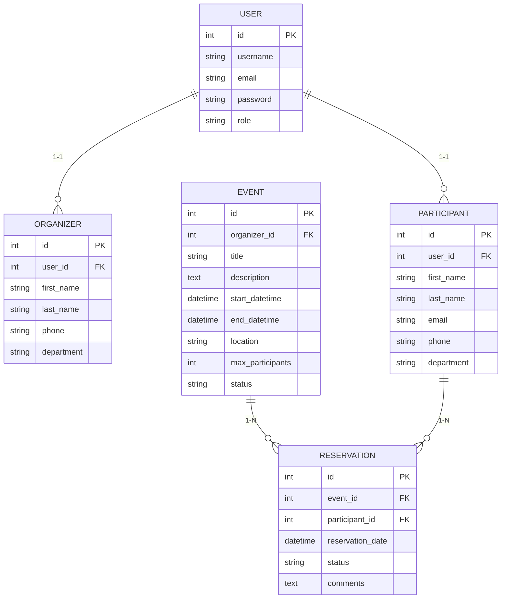

---

## 5. Architecture du Projet

### Structure des Fichiers

```text
entreprise_events/
├── .gitignore
├── docker-compose.yml
├── README.md
├── docs/
│   ├── documentation-technique.md
│   ├── MCD.png
│   └── wireframes/
├── src/
│   ├── config/
│   │   ├── database.php
│   │   └── constants.php
│   ├── controllers/
│   │   ├── AuthController.php
│   │   ├── EventController.php
│   │   ├── HomeController.php
│   │   ├── OrganizerController.php
│   │   ├── ParticipantController.php
│   │   └── ReservationController.php
│   ├── models/
│   │   ├── Database.php
│   │   ├── Event.php
│   │   ├── Organizer.php
│   │   ├── Participant.php
│   │   ├── Reservation.php
│   │   └── User.php
│   ├── views/
│   │   ├── auth/
│   │   │   ├── login.php
│   │   │   └── register.php
│   │   ├── events/
│   │   │   ├── create.php
│   │   │   ├── edit.php
│   │   │   ├── index.php
│   │   │   └── show.php
│   │   ├── organizers/
│   │   │   ├── index.php
│   │   │   └── show.php
│   │   ├── participants/
│   │   │   ├── index.php
│   │   │   └── show.php
│   │   ├── reservations/
│   │   │   ├── create.php
│   │   │   └── index.php
│   │   ├── partials/
│   │   │   ├── footer.php
│   │   │   ├── header.php
│   │   │   └── navbar.php
│   │   ├── layouts/
│   │   │   └── main.php
│   │   └── home.php
│   ├── utils/
│   │   ├── Auth.php
│   │   ├── Validator.php
│   │   └── helpers.php
│   ├── assets/
│   │   ├── css/
│   │   │   └── style.css
│   │   ├── js/
│   │   │   └── main.js
│   │   └── images/
│   └── index.php
└── docker/
    ├── mysql/
    │   └── init.sql
    └── php/
        └── Dockerfile
```

### Schéma MVC
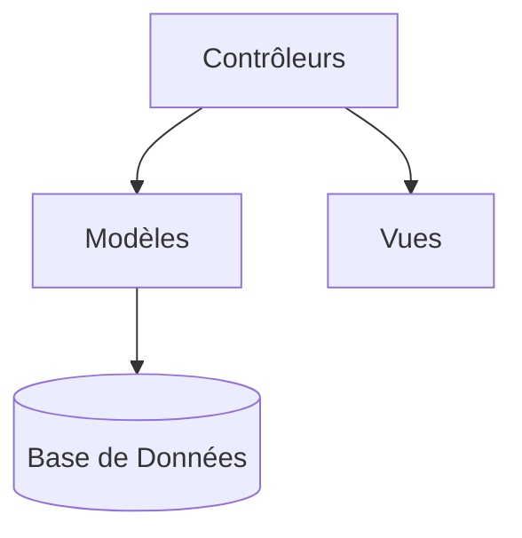

---

## 6. Technologies Utilisées

### Backend
- PHP 8.2
- MySQL 8.0
- PDO

### Frontend
- HTML5, CSS3, JavaScript
- Bootstrap 5, Font Awesome

### Infrastructure
- Docker, Apache, Composer

---

## 7. Choix Techniques et Patterns Utilisés
- **MVC** : Organisation du code
- **PDO** : Sécurité des requêtes
- **Sessions PHP** : Authentification
- **Docker Compose** : Orchestration des conteneurs

---

## 8. Concepts Fondamentaux du Développement Web

- Architecture MVC
- Opérations CRUD
- Distinction Backend / Frontend
- Programmation Orientée Objet
- Client-Serveur
- Conteneurisation avec Docker
- Sécurité (injections SQL, validation...)

---

## 9. Guide d'Installation et de Déploiement

### Prérequis
- Docker, Docker Compose
- Git

### Installation

```bash
git clone https://github.com/Mohammad77Radwan/Entreprise_Events.git
cd Entreprise_Events
docker-compose up -d
```

- Accès local : http://localhost:8080
- phpMyAdmin : http://localhost:8081 (root/root)

---

## 10. Manuel d’Utilisation

### Connexion
- Via `http://localhost:8080/login`

### Tableau de Bord
- Statistiques, navigation

### Gestion des Événements
- Création / édition / suppression

### Réservations
- Inscription des participants
- Export des listes

---

## 11. Fonctionnalités

| Fonctionnalité           | Route                | Fichiers Concernés           |
|--------------------------|----------------------|------------------------------|
| Authentification         | /auth/login          | AuthController.php, User.php |
| Création d'événements    | /events/create       | EventController.php          |
| Gestion des participants | /participants        | ParticipantController.php    |
| Réservations             | /reservations/create | ReservationController.php    |

### Exemple de Code

```php
public function create() {
    Auth::redirectIfNotOrganizer();
    if ($_SERVER['REQUEST_METHOD'] === 'POST') {
        $eventId = $this->eventModel->create(
            $_SESSION['user_id'],
            $_POST['title'],
            $_POST['description'],
            $_POST['start_datetime'],
            $_POST['end_datetime'],
            $_POST['location'],
            (int)$_POST['max_participants']
        );
    }
}
```

---

## 12. Sécurité

### Mesures Implémentées
- Requêtes préparées (`PDO`)
- Échappement HTML
- Hash des mots de passe (`password_hash`)
- Headers HTTP : CSP, XSS protection

---

## 13. Difficultés Rencontrées et Solutions Apportées

| Problème                     | Solution                                                        |
|-----------------------------|------------------------------------------------------------------|
| Intégration de Docker       | Lecture documentation officielle                                |
| Sécurité des données        | Requêtes préparées, validation des entrées                      |
| Responsive design           | Intégration de Bootstrap                                        |

---

## 14. Perspectives d’Évolution

### Fonctionnalités
- Export PDF
- Calendrier interactif (`FullCalendar.js`)
- Notifications email

### Techniques
- Migration vers Symfony / Laravel
- API REST
- Authentification SSO


# 15. Liste des termes à définir

##  Architecture MVC (Modèle-Vue-Contrôleur)

Le modèle MVC permet de structurer une application web en trois couches indépendantes :

### 1. Modèle (Model)
- Gère les **données** et la **logique métier**.
- Interagit directement avec la base de données.
- Ne contient aucune logique d'affichage.

**Exemple : `Event.php`**
```php
class Event {
    public static function getAllEvents() {
        $db = Database::connect();
        return $db->query("SELECT * FROM events")->fetchAll();
    }
}
```

### 2. Vue (View)
- Affiche les données à l'utilisateur.
- Ne contient pas de logique métier.

**Exemple : `views/events/index.php`**
```php
<?php foreach ($events as $event): ?>
    <h2><?= htmlspecialchars($event['title']) ?></h2>
<?php endforeach; ?>
```

### 3. Contrôleur (Controller)
- Reçoit les requêtes utilisateur.
- Interagit avec le modèle et choisit la vue à afficher.

**Exemple : `EventController.php`**
```php
$events = Event::getAllEvents();
require 'views/events/index.php';
```

---

##  CRUD (Create, Read, Update, Delete)

Les 4 opérations fondamentales de gestion de données :

- **Create** : Créer une nouvelle ressource
- **Read** : Lire ou consulter des ressources existantes
- **Update** : Modifier une ressource existante
- **Delete** : Supprimer une ressource

### Routes typiques
| Opération | Route | Description |
|----------|--------|-------------|
| Create | `/events/create` (GET) | Formulaire de création |
| Create | `/events` (POST) | Traitement du formulaire |
| Read   | `/events` (GET) | Liste des événements |
| Update | `/events/3/edit` (GET) | Formulaire de modification |
| Update | `/events/3` (POST) | Sauvegarde des modifications |
| Delete | `/events/3/delete` (POST) | Suppression |

---

##  Backend vs Frontend

### Backend
- Exécuté côté **serveur**
- Gère la logique, les calculs, les accès à la base
- **Technos** : PHP, Node.js, Python, MySQL

### Frontend
- Exécuté côté **client** (navigateur)
- Gère l’affichage et les interactions utilisateur
- **Technos** : HTML, CSS, JavaScript, Bootstrap

---

##  Programmation Orientée Objet en PHP

### Concepts fondamentaux :
- **Classe** : plan de construction d’objets
- **Objet** : instance d’une classe
- **Encapsulation** : masquage des données internes (`private`, `protected`)
- **Héritage** : réutilisation de code entre classes (`extends`)
- **Polymorphisme** : comportement différent selon le contexte

### Exemple :
```php
class User {
    private $email;
    public function __construct($email) {
        $this->email = $email;
    }
    public function getEmail() {
        return $this->email;
    }
}
```

---

##  Client-Serveur

- Le **client** envoie des requêtes HTTP
- Le **serveur** les traite, interagit avec la base de données, renvoie une réponse HTML

### Exemple de flux :
1. Client : `GET /events`
2. Serveur : exécute `EventController.php`
3. Appelle `Event::getAllEvents()`
4. Inclut `index.php` avec les données
5. Envoie la page HTML au navigateur

---

##  PHP 8.x

### Nouveautés :
- **Union types** : `function process(int|string $id)`
- **Attributs** : remplace les annotations
- **Match expression** : plus clair que `switch`
- **JIT (Just-in-time)** : meilleures performances

### Exemple :
```php
function describeStatus(int|string $status): string {
    return match($status) {
        1 => 'Active',
        0 => 'Inactive',
        default => 'Unknown',
    };
}
```

---

## MySQL

### SGBD relationnel :
- Organise les données en **tables**
- Supporte **SQL** (Structured Query Language)

### Commandes SQL de base :
```sql
SELECT * FROM events;
INSERT INTO users (name, email) VALUES ('Alice', 'alice@mail.com');
UPDATE reservations SET status='confirmed' WHERE id=5;
DELETE FROM participants WHERE id=12;
```

---

##  HTML5 / CSS3

### HTML5 :
- Structure d’une page (titres, paragraphes, formulaires, etc.)

### CSS3 :
- Mise en forme : couleurs, polices, animations

### Responsive Design :
```css
@media screen and (max-width: 768px) {
    body {
        font-size: 14px;
    }
}
```

---

##  JavaScript

### Utilités :
- Dynamiser les pages web
- Réagir aux événements (clics, soumission de formulaire)

### Manipulation DOM :
```js
document.getElementById("btn").addEventListener("click", function() {
    alert("Bonjour !");
});
```

### Validation formulaire :
```js
if (document.getElementById('email').value === '') {
    alert('Email requis');
    return false;
}
```

---

##  Docker et conteneurisation

### Docker :
- Exécute des applications dans des **conteneurs** isolés

### Docker vs VM :
- Plus rapide, plus léger, sans système d’exploitation complet

### Docker Compose :
```yaml
version: '3.8'
services:
  web:
    build: .
    ports:
      - "80:80"
  db:
    image: mysql:5.7
    environment:
      MYSQL_ROOT_PASSWORD: root
```

### Image vs Conteneur :
- **Image** : modèle figé
- **Conteneur** : instance vivante de l’image
- **Cycle de vie** : `docker build` → `run` → `stop` → `rm`

---

##  Sécurité Web (débutant)

### 1. Injection SQL :
- **Risque** : exécution de requêtes malveillantes

 Dangereux :
```php
$sql = "SELECT * FROM users WHERE email = '$_POST[email]'";
```

 Sécurisé :
```php
$stmt = $pdo->prepare("SELECT * FROM users WHERE email = ?");
$stmt->execute([$_POST['email']]);
```

### 2. Validation des données :
```php
$email = filter_var($_POST['email'], FILTER_VALIDATE_EMAIL);
```

### 3. Hachage des mots de passe :
```php
$hash = password_hash($password, PASSWORD_DEFAULT);
password_verify($password, $hash);
```

### 4. Session PHP :
```php
session_start();
$_SESSION['user_id'] = 123;
```

---

##  Base de données

### MCD (Modèle Conceptuel de Données) :
- Représente la structure logique des entités

### Entités :
- `Utilisateur`, `Événement`, `Réservation`

### Clés :
- **Primaire** : identifie chaque ligne
- **Étrangère** : relie deux tables

### Relations :
- 1-1 : `utilisateur` - `profil`
- 1-N : `événement` - `réservations`
- N-N : `participants` - `événements` via table `event_user`

---

##  PDO (PHP Data Objects)

### Avantages :
- Compatible avec plusieurs SGBD
- Sécurité via requêtes préparées

### Exemple :
```php
$pdo = new PDO("mysql:host=localhost;dbname=myapp", "root", "");
$stmt = $pdo->prepare("SELECT * FROM events WHERE id = ?");
$stmt->execute([$id]);
```

---

##  Versioning et collaboration

### Git :
- `git init` : initialiser un dépôt
- `git add .` : ajouter les fichiers
- `git commit -m "Message"` : enregistrer un changement
- `git push` / `git pull` : synchronisation avec le dépôt distant

### GitHub :
- Hébergement de code
- Pull requests, issues, gestion de versions
- **README.md** :
```markdown
# Mon projet d’événements
Ce projet permet de gérer des événements et des réservations...
```

---

##  Méthodologie de développement

### Types de tests :
- **Manuels** : test via formulaire, clics
- **Automatisés** : via PHPUnit

```php
use PHPUnit\Framework\TestCase;

class EventTest extends TestCase {
    public function testEventTitle() {
        $event = new Event("Concert");
        $this->assertEquals("Concert", $event->getTitle());
    }
}
```

### Débogage :
```php
var_dump($variable);
error_log("Erreur : " . $e->getMessage());
```

### Documentation :
- **Commentaires** clairs
- **PHPDoc** :
```php
/**
 * Récupère l'événement par ID
 * @param int $id
 * @return array
 */
function getEvent($id) { ... }
```

---

## 16. Galerie d’Images

### 1. Interface Docker – Conteneurs actifs
Affichage des conteneurs Docker actifs liés au projet `entreprise_events`, incluant les services `php`, `mysql`, `phpmyadmin`, `web`, et `db`.
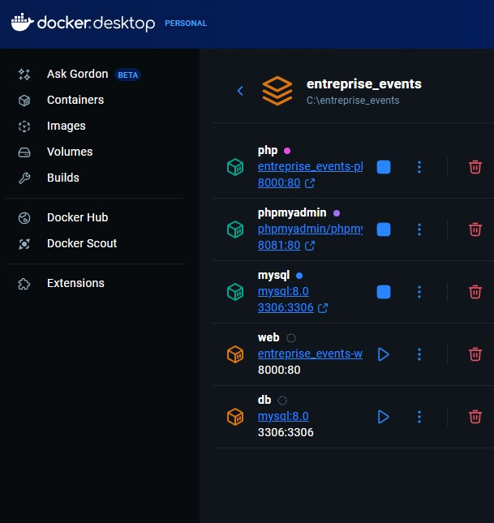

### 2. Interface Docker – Images disponibles
Liste des images Docker locales utilisées par le projet, incluant les images PHP, MySQL et phpMyAdmin.
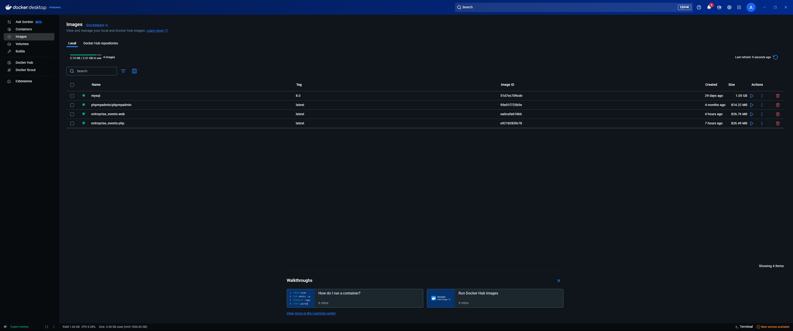

### 3. Interface Docker – Historique des builds
Historique des builds Docker pour le service PHP, affichant les différentes versions créées lors du développement.
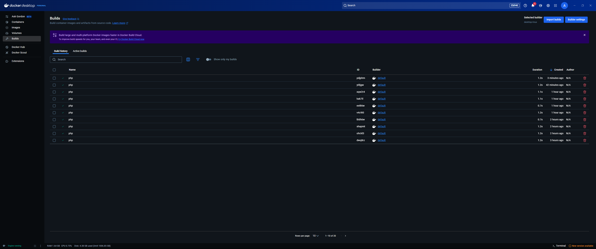

### 4. Modèle relationnel de la base de données
Diagramme des relations entre les tables : `users`, `organizers`, `participants`, `events`, et `reservations`, illustrant les clés primaires/étrangères.


### 5. Page des événements – Vue administrateur
Page listant les événements avec leurs détails : titre, organisateur, date, lieu, statut et options de visualisation.
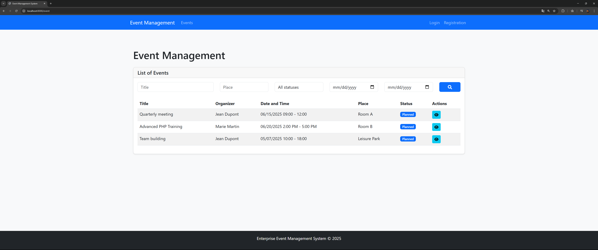

### 6. Recherche par date – Filtres dynamiques
Utilisation d’un calendrier pour filtrer les événements selon une plage de dates précise.
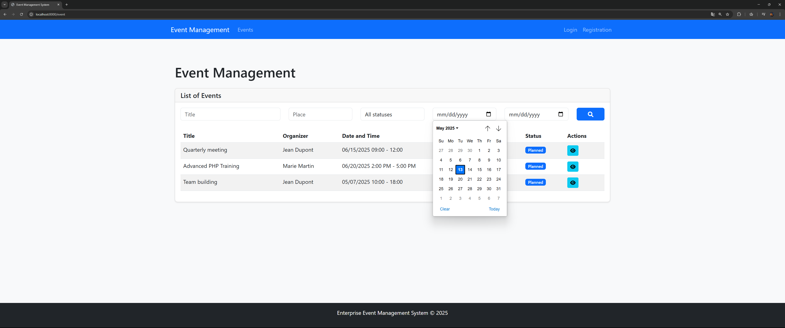

### 7. Filtrage par statut
Liste déroulante permettant de filtrer les événements selon leur statut : planifié, en cours, terminé ou annulé.
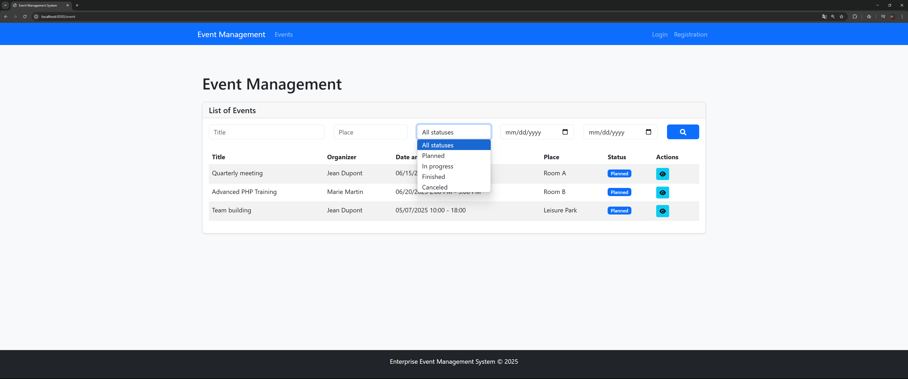

### 8. Tableau de bord utilisateur
Tableau de bord affichant les événements à venir avec informations essentielles : titre, date, lieu et bouton d’action.
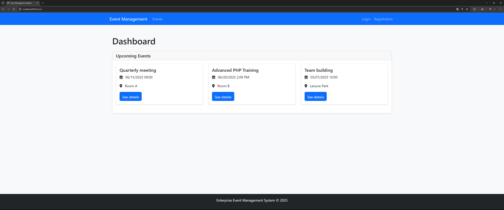

### 9. Formulaire d’inscription utilisateur
Formulaire permettant aux nouveaux utilisateurs de s’inscrire avec nom d'utilisateur, e-mail et mot de passe sécurisé.
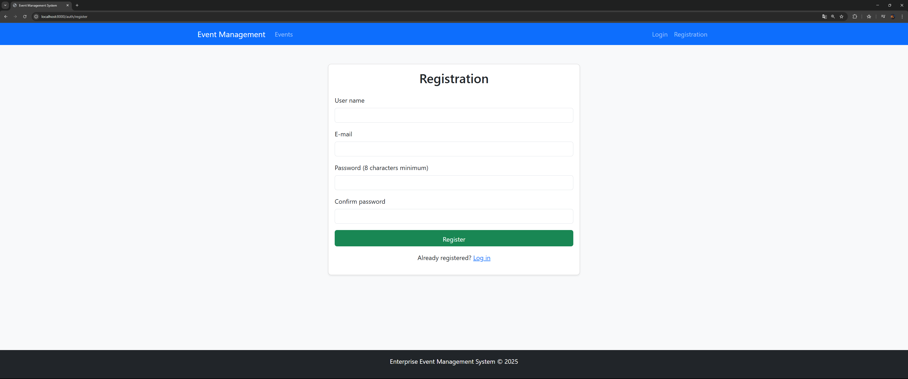

### 10. Formulaire de connexion
Interface de connexion avec champs pour nom d'utilisateur et mot de passe.
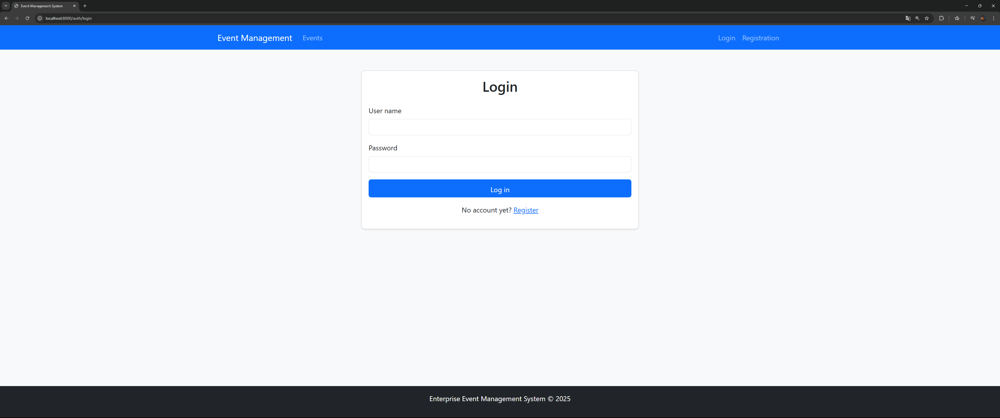
