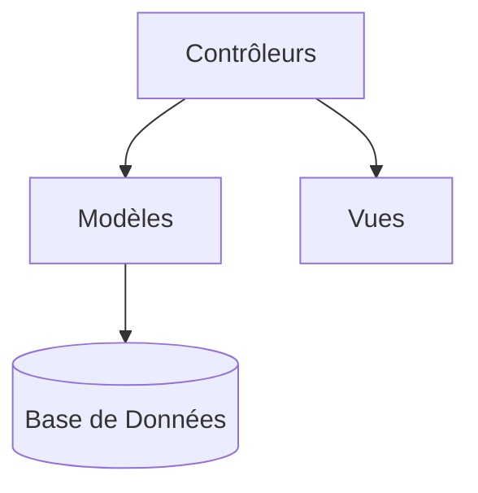

# Documentation Technique - Système de Gestion des Événements d'Entreprise

## Table des Matières
- [Documentation Technique - Système de Gestion des Événements d'Entreprise](#documentation-technique---système-de-gestion-des-événements-dentreprise)
  - [Table des Matières](#table-des-matières)
  - [1. Introduction](#1-introduction)
  - [2. Technologies Utilisées](#2-technologies-utilisées)
    - [Backend](#backend)
    - [Frontend](#frontend)
    - [Infrastructure](#infrastructure)
  - [3. Architecture du Projet](#3-architecture-du-projet)
    - [Structure des Fichiers](#structure-des-fichiers)
    - [Schéma MVC](#schéma-mvc)
  - [4. Modèle de Données](#4-modèle-de-données)
    - [Diagramme MCD](#diagramme-mcd)
      - [Tables Principales](#tables-principales)
  - [5. Installation et Déploiement](#5-installation-et-déploiement)
      - [1. Cloner le dépôt](#1-cloner-le-dépôt)
      - [2. Démarrer les conteneurs](#2-démarrer-les-conteneurs)
      - [3. Accéder à l'application](#3-accéder-à-lapplication)
  - [6. Fonctionnalités](#6-fonctionnalités)
    - [Fonctionnalités Principales](#fonctionnalités-principales)
      - [Exemple de Code :](#exemple-de-code-)
  - [7. Sécurité](#7-sécurité)
    - [Mesures Implémentées](#mesures-implémentées)
  - [8. Perspectives](#8-perspectives)
    - [Évolutions Possibles](#évolutions-possibles)

---

## 1. Introduction
Application web développée dans le cadre du BTS SIO SLAM pour la gestion des événements en entreprise. Permet :
- La création et gestion d'événements
- L'inscription des participants
- La visualisation des réservations
- La gestion des organisateurs

## 2. Technologies Utilisées

### Backend
- **PHP 8.2** (architecture MVC)
- **MySQL 8.0** (base de données)
- **PDO** (accès sécurisé à la base)

### Frontend
- **HTML5**, **CSS3**, **JavaScript**
- **Bootstrap 5** (interface responsive)
- **Font Awesome** (icônes)

### Infrastructure
- **Docker** (conteneurisation)
- **Apache** (serveur web)
- **Composer** (gestion des dépendances)

## 3. Architecture du Projet

### Structure des Fichiers

```text
entreprise_events/
├── .gitignore
├── docker-compose.yml
├── README.md
├── docs/
│   ├── documentation-technique.md
│   ├── MCD.png
│   └── wireframes/
├── src/
│   ├── config/
│   │   ├── database.php
│   │   └── constants.php
│   ├── controllers/
│   │   ├── AuthController.php
│   │   ├── EventController.php
│   │   ├── HomeController.php
│   │   ├── OrganizerController.php
│   │   ├── ParticipantController.php
│   │   └── ReservationController.php
│   ├── models/
│   │   ├── Database.php
│   │   ├── Event.php
│   │   ├── Organizer.php
│   │   ├── Participant.php
│   │   ├── Reservation.php
│   │   └── User.php
│   ├── views/
│   │   ├── auth/
│   │   │   ├── login.php
│   │   │   └── register.php
│   │   ├── events/
│   │   │   ├── create.php
│   │   │   ├── edit.php
│   │   │   ├── index.php
│   │   │   └── show.php
│   │   ├── organizers/
│   │   │   ├── index.php
│   │   │   └── show.php
│   │   ├── participants/
│   │   │   ├── index.php
│   │   │   └── show.php
│   │   ├── reservations/
│   │   │   ├── create.php
│   │   │   └── index.php
│   │   ├── partials/
│   │   │   ├── footer.php
│   │   │   ├── header.php
│   │   │   └── navbar.php
│   │   ├── layouts/
│   │   │   └── main.php
│   │   └── home.php
│   ├── utils/
│   │   ├── Auth.php
│   │   ├── Validator.php
│   │   └── helpers.php
│   ├── assets/
│   │   ├── css/
│   │   │   └── style.css
│   │   ├── js/
│   │   │   └── main.js
│   │   └── images/
│   └── index.php
└── docker/
    ├── mysql/
    │   └── init.sql
    └── php/
        └── Dockerfile
```

### Schéma MVC


## 4. Modèle de Données

### Diagramme MCD
```mermaid
erDiagram
    USER {
        int id PK
        string username
        string email
        string password
        string role
    }
    USER ||--o{ ORGANIZER : "1-1"
    USER ||--o{ PARTICIPANT : "1-1"
    
    ORGANIZER {
        int id PK
        int user_id FK
        string first_name
        string last_name
        string phone
        string department
    }
    
    PARTICIPANT {
        int id PK
        int user_id FK
        string first_name
        string last_name
        string email
        string phone
        string department
    }
    
    EVENT {
        int id PK
        int organizer_id FK
        string title
        text description
        datetime start_datetime
        datetime end_datetime
        string location
        int max_participants
        string status
    }
    
    RESERVATION {
        int id PK
        int event_id FK
        int participant_id FK
        datetime reservation_date
        string status
        text comments
    }
    
    EVENT ||--o{ RESERVATION : "1-N"
    PARTICIPANT ||--o{ RESERVATION : "1-N"
 ```


#### Tables Principales

1. users : Gestion des comptes

2. organizers : Informations des organisateurs

3. participants : Informations des participants

4. events : Détails des événements

5. reservations : Liaison participants-événements

## 5. Installation et Déploiement

Prérequis

* Docker et Docker Compose

* Git

Instructions : 

#### 1. Cloner le dépôt
git clone https://github.com/votre-repo/entreprise_events.git
cd entreprise_events

#### 2. Démarrer les conteneurs
docker-compose up -d --build

#### 3. Accéder à l'application
http://localhost:8000


| Rôle           | Identifiants     |
| -------------- | ---------------- |
| Administrateur | admin / password |
| Organisateur   | org1 / password  |
| Participant    | part1 / password |


## 6. Fonctionnalités

### Fonctionnalités Principales


| Fonctionnalité           | Route                | Fichiers Concernés           |
| ------------------------ | -------------------- | ---------------------------- |
| Authentification         | /auth/login          | AuthController.php, User.php |
| Création d'événements    | /events/create       | EventController.php          |
| Gestion des participants | /participants        | ParticipantController.php    |
| Système de réservation   | /reservations/create | ReservationController.php    |


#### Exemple de Code : 


```php
// Création d'un événement (EventController.php)
public function create() {
    Auth::redirectIfNotOrganizer();
    
    if ($_SERVER['REQUEST_METHOD'] === 'POST') {
        $eventId = $this->eventModel->create(
            $_SESSION['user_id'],
            $_POST['title'],
            $_POST['description'],
            $_POST['start_datetime'],
            $_POST['end_datetime'],
            $_POST['location'],
            (int)$_POST['max_participants']
        );
        // Redirection après création
    }
}
```


## 7. Sécurité

### Mesures Implémentées

**Protection des données :**

* Préparation des requêtes SQL (`PDO`)
* Échappement HTML (`htmlspecialchars`)

**Authentification :**

* Hachage des mots de passe (`password_hash`)
* Gestion des sessions sécurisées

**En-têtes HTTP :**

* CSP (Content Security Policy)
* XSS Protection
* Referrer Policy

---

## 8. Perspectives

### Évolutions Possibles

**Fonctionnalités :**

* Export PDF des participants
* Calendrier interactif (`FullCalendar.js`)
* Notifications par email

**Techniques :**

* Migration vers Symfony/Laravel
* API REST pour mobile
* Intégration SSO
